# Sterling EWB - Programming with WICED on Windows

This tutorial shows how to get the [Laird Sterling EWB](https://www.lairdconnect.com/wireless-modules/wifi-modules-bluetooth/sterling-ewb-iot-module) DVK setup for programming with WICED via USB JTAG or External JTAG on a Windows PC.

## Required Items

### Hardware Required

Two different development kits are available with part numbers supporting two different antenna types.

- DVK 455-00030 Chip Antenna
- DVK 455-00031 External Antenna

Additional items needed:

- 4.4-10V Power Supply
- [TTL-232R-3v3 cable](https://octopart.com/ttl-232r-3v3-ftdi-5416714)
- USB cable - Type A to micro type B (included in DVK kit)
- JLink Plus

### Software Required

Software is provided by Infineon/Cypress based off Eclipse which is called WICED. WICED can be download from the link below. It **must be installed in a shorter path without spaces to prevent pathing issues** than the default pathing provided by WICED. Example of a short path without spaces for windows is **C:\WICED-Studio-6.6**.

- [WICED Studio Software](https://www.infineon.com/cms/en/design-support/tools/sdk/wireless-connectivity-wiced-software-sdk/)

### Documentation

Documentation for the Laird DVK is available on the Laird Sterling EWB. This includes product briefs, datasheets, guides, certifications, technical drawings, software, and application notes.

- [Laird - Sterling EWB Documentation](https://www.lairdconnect.com/wireless-modules/wifi-modules-bluetooth/sterling-ewb-iot-module#documentation)

## Hardware Setup

The Sterling EWB has a lot of flexibility when it comes to powering, IO interface, JTAG, etc. The board was designed with the use of USB JTAG in mind and when an external JTAG was added to the board it was unknown how the USB JTAG and external JTAG would work well with each other. What has been found is the FTDI USB interferes with the external JTAG and a hardware modification is required. This can be seen below with the added switch tied to the FTDI U8/14 to ground at the leg of SW4. The switch allows for being able to switch between USB JTAG and external JTAG. It's recommended to use one or the other, using both at the same time could potentially damage one of the JTAG interfaces.

### Hardware modification

Below is an example of the hardware modification. With the switch set to ON it's completing the circuit from U8/14 on the FTDI side to the GND leg of SW4. If desired a wire could be ran between leaving out the switch and making only the external JTAG available. This modification puts the FTDI chip into RESET preventing any conflict between the USB JTAG and external JTAG.

Physical view of hardware modification:

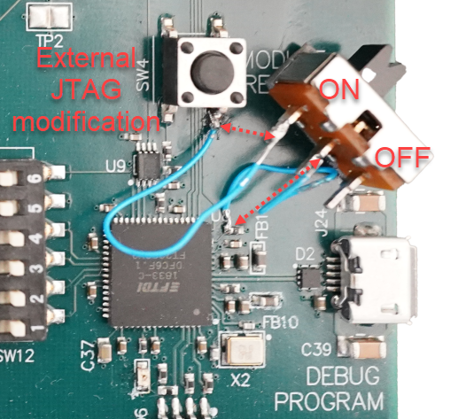

Schematic view of hardware modification:

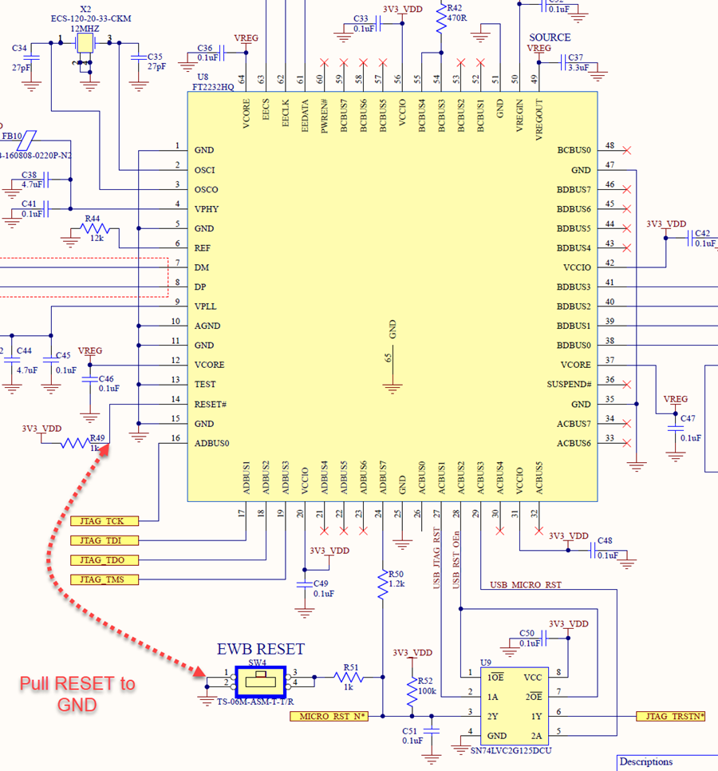

### USB JTAG

The USB1 Debug/Program Interface is the default JTAG interface. Software can be downloaded and debugged via this interface.

- Set SW12 all to ON
- Set SW7 to USB
- If hardware modification is in place ensure switch is off (not connecting U8/14 to GND)

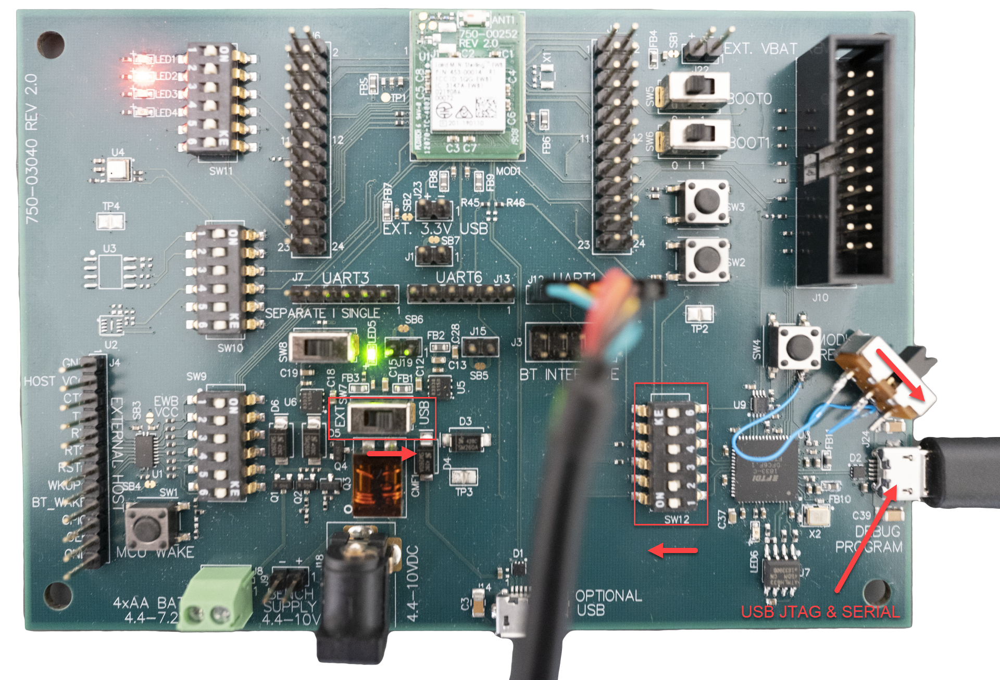

### External JTAG

The external JTAG (J10) can be used to program and debug with the hardware modification in place.

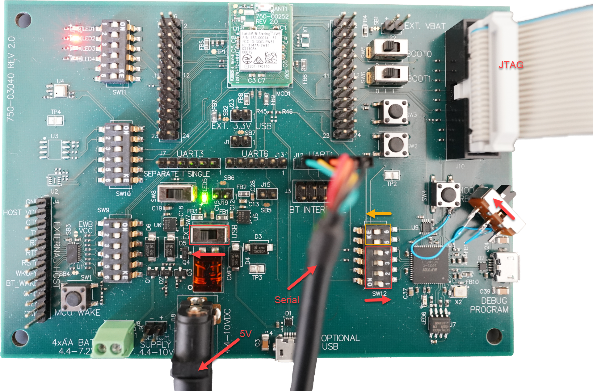

*Note using the external JTAG does disable the UART connection on the debug/programming USB1 connector. Please use UART1 (J12) for a serial interface for debugging. **Do not use both USB JTAG and external JTAG at the same time to prevent damage.**

## Software Setup

The Sterling can be used either with AT Commands or Programmed with WICED. This tutorial will cover Programming with WICED as the AT commands are well documented.

### AT Commands

- [AT Command Guide](https://www.lairdconnect.com/documentation/command-guide-sterling-ewb)
- [AT Command Quick Start Guide](https://www.lairdconnect.com/documentation/command-quick-start-guide-sterling-ewb)

### Programming with WICED

#### Setup

1. Install the IDE into a short path as this will prevent any pathing issues with folders with spaces in them.

   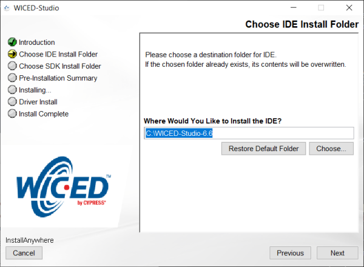

2. Install the SDK into the same path for easy of use and to avoid any pathing issues with folders with spaces in them.

   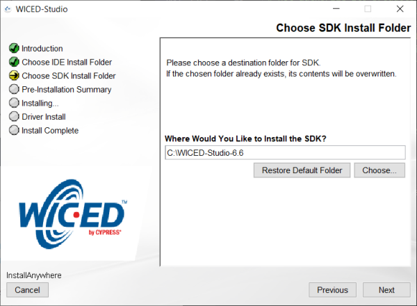

3. From here the install is straight forward, finish the install.

4. The jlink configuration needs adjusted. Edit the following file "C:\WICED-Studio-6.6\43xxx_Wi-Fi\tools\OpenOCD\jlink.cfg" shown below. If you've elected to install the SDK in a different location then this file will be located accordingly.

    ```
    interface jlink

    reset_config trst_and_srst srst_open_drain
    ```

5. The driver that WICED is using in this walk-thru is libusbk and can be installed using [Zadiag generic USB drivers](https://zadig.akeo.ie/). If Jlink drivers are installed then when in Zadiag set the following to install generic libusbk driver.

   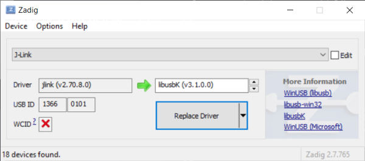

    When using the Jlink Plus with the libusbk driver installed the device manager will look like:

    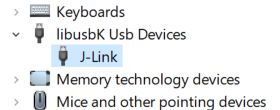
  
6. Download the example demo at https://github.com/LairdCP/ewb_wiced_demo and extract the contents of "43xxx_Wi-Fi" folder to "C:\WICED-Studio-6.6\43xxx_Wi-Fi". This provides an example but also platform specific files.

    If you want to use the Laird demo follow the instructions on the ewb_wiced_demo github to download the rest of the components.

7. Now that platform specific files for the LAIRD_EWB are installed a make target can be created for the desired example. For example snip.apsta make targets would be:

    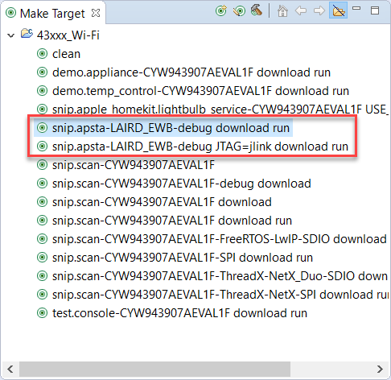

   1. USB JTAG make target will be:

      ```
      snip.apsta-LAIRD_EWB-debug download run
      ```
   2. External JTAG make target will be:

      ```
      snip.apsta-LAIRD_EWB-debug JTAG=jlink download run
      ```

      **Note the -debug is needed for debugging**

#### Troubleshooting WICED

  If the target fails to download ensure the hardware is setup correctly. Next make sure to use the correct make target for the JTAG interface being used.

  If this is the first time running WICED and downloading to target then a window should popup asking for firewall access for the openocd-all-brcm-libftdi.exe. If this popup doesn't appear then this can be fixed either by manually editing the firewall or running the openocd-all-brcm-libftdi.exe. Manually running the openocd-all-brcm-libftdi.exe file is the easiest way to add these to the firewall.
  
##### Firewall settings for OpenOCD

  Firewall settings should look similar to:

  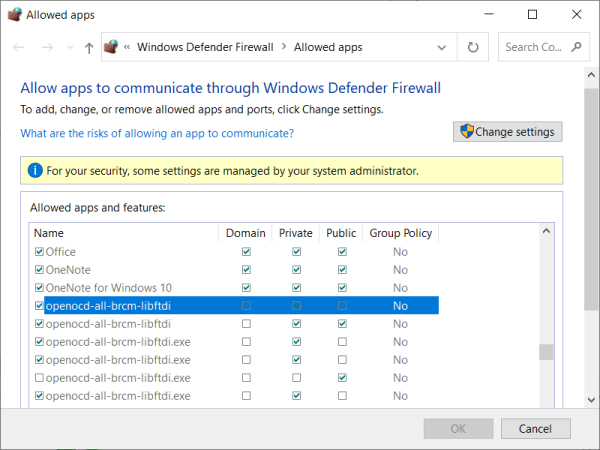

##### Manually running OpenOCD

  To manually run the openocd-all-brcm-libftdi.exe file go to folder "C:\WICED-Studio-6.6\43xxx_Wi-Fi\tools\OpenOCD\Win32\openocd-all-brcm-libftdi.exe" and double click on it. This should bring up the dialog box to allow for firewall access. If not this will have to be added manually. If the rules can't be added manually then you may need to contact your system administrator.

##### make clean

  When switching projects or JTAG interfaces it's best practice to do a clean from the make target selection:

  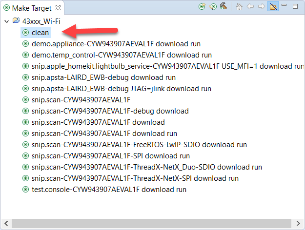

##### openocd already running

  Occasionally a download will still fail and this could be due to openocd-all-brcm-libftdi.exe already running in the background. Check the Task Manager to ensure openocd-all-brcm-libftdi.exe isn't already running or running multiple times. Close any process of openocd-all-brcm-libftdi.exe and try downloading again.

  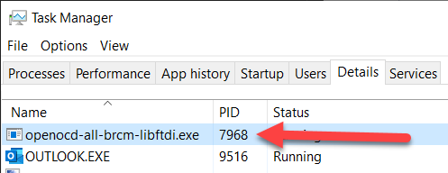

#### Debugging

Using the external JTAG the application is downloaded to target debugging can be started by:

  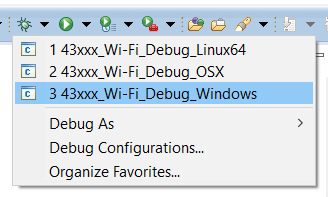

Once in debugging and running, then add breakpoints. Below you can see a stop at breakpoint and variables values.

  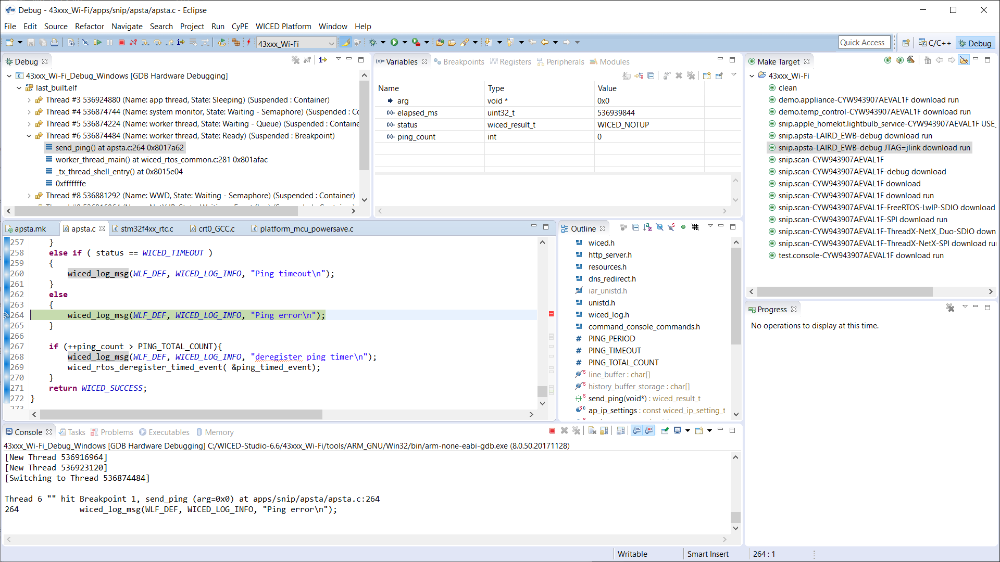

## Additional Information and Support

- [Sterling-EWB Product Page](https://www.lairdconnect.com/wireless-modules/wifi-modules-bluetooth/sterling-ewb-iot-module)
- [Sterling-EWB Documentation](https://www.lairdconnect.com/wireless-modules/wifi-modules-bluetooth/sterling-ewb-iot-module#documentation)
- [Sterling-EWB FAQs](https://www.lairdconnect.com/wireless-modules/wifi-modules-bluetooth/sterling-ewb-iot-module#faq)
- [Sterling-EWB Demo on GitHub](https://github.com/LairdCP/ewb_wiced_demo)
- [Laird Support (scroll to bottom of page and select Open a Support Ticket)](https://www.lairdconnect.com/resources/support)